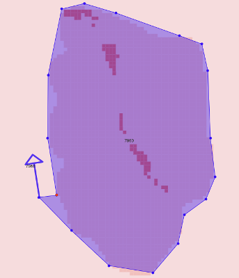
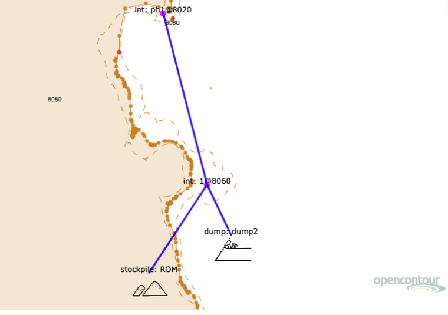

## How to Quickly Set Up a Scheduled Mine Plan in Opencontour

---

This document is intended to help users set up a basic, scheduled mine plan within 15-20 minutes. For this reason, not every function offered by Opencontour will be covered in this outline. For further guidance, please reference the **Mine Design Help Guide**. This document can be found in Opencontour by clicking **Help** on the top ribbon, then **Help Guide**.

---
## Quick Access:
- [Getting Started](#1)
- [Importing Model and Base Layers](#2)
- [Viewing Model Data](#3)
- [Adding a Geotech Layer](#4)
- [Drawing a Pit](#5)
- [Cutting a Pit](#6)
- [Setting up Trucks and Loaders](#7)
- [Setting up Phases and Destinations](#8)
- [Setting up Roads](#9)
- [Building the Mineplan](#10)
- [Mineplan Scheduling](#11)
- [Process Scheduling](#12)
- [Finance Scripting](#13)
- [Schedule Quick-Charting](#14)
- [Alternative Chart Methods](#15)
---

### Getting Started
- The first step to any Opencontour project is navigating to the **New Project** button in the home menu
  - Give the project a name and description while here
- The next step is setting up the **Project Settings** in the second window

*Project Settings Window*

- Project settings can be manually input or imported using a .json file format

### Importing Model and Base Layers
- The next step is to import an existing ***Model*** file that will be used as the basis for the project
  - ***Model*** layers contain grade data that are used to calculate ore/waste related values used in the final mineplan
- Drag the existing ***Model*** file into the viewer window
- Now, import a ***Base*** file into the project
  - ***Base*** layers contain general topography and elevation data
- Drag the existing Base file into the viewer window
- The viewer window should look like this now:

*Viewer w/ Loaded Model and Base Layers*

### Viewing Model Data
- To view ***Model*** data, navigate to **Project Properties**, then to **Legend**
- Click on **Property**, and write the name of the grade variable (i.e. au, ag, pb, etc.)
- Click on the box labeled **Color** and select one of the monochromatic schemes, then **Save Legend**
  - To alter the legend values, click on one of the ‘<’ boxes and simply change to the desired value
- In the viewer window, go to the tab marked **Legend** and click the check box. Then, select ***Model*** and the grade variable (i.e. au, ag, pb, etc.)
- The viewer window should look like this:

*Model Layer w/ Legend*

### Adding a Geotech Layer
- The next step is to add a ***Geotech*** layer to the project:
  - ***Geotech*** layers contain BFA/IRA data, among other geological parameters, that alters feature creation
  - ***Geotech*** data can be entered manually or by dragging in a .json file
- To manually enter geotech data, go to the ***Geotech*** layer and select **addGeotech**. Then, select the Properties icon and click on the ***Geotech*** shape in the viewing window
- The viewer should now look like this:

*Geotech Properties Window*

- The two most important parameters on this panel are Bench Face Angle (**BFA**) and Innerramp Angle (**IRA**)

### Drawing a Pit
- The next step is to populate the ***Cutter*** layer by creating an open pit
- Begin by clicking the **Add Layer** icon, and selecting **Add Cutter Layer**
- Click on the ***Cutter*** layer until it is highlighted orange, then select **Add Polygon Features**
- Navigate to bottom or top of desired pit using `Q` and `W` keys and begin drawing the shape of the pit, with/without a ramp
- Be mindful of these windows as they have several important pit-drawing features:

*Viewer Window - Drawing Settings (1 of 2)*

*Viewer Window - Drawing Settings (2 of 2)*

- HELPFUL DRAWING TIPS:
  - Select/Deselect the blue check mark  to include a **Ramp** (or not)
  - Underneath the **Ramp** heading shows which way the pit will build, for example:
      - If a clockwise pit polygon is drawn with **clockwiseUp** selected, the pit and ramp will build *upwards* in a *clockwise* direction
      - If a counterclockwise pit polygon is drawn with **counterclockwiseDown** selected, the pit and ramp will build *downwards* in a *counterclockwise* direction
  - The **Dbl/triple** feature gives the option to single, double, triple, or quadruple bench the pit
  - The **Scaler** feature sets a circular boundary around the cursor using a set distance chosen by the user. Use this feature to design the ramp width and mining distance around blocks
  - **ViewWidth** allows the user to see up/down a set elevation when in a particular viewer elevation

- Now, draw the pit shape. It should look similar to the image displayed below:

*Pit Drawing - clockwiseUp w/ Ramp*

- If the pit shape is unsatisfactory, use the **Edit Features** button to manipulate the vertices on the pit shape

### Cutting a Pit
- Once the user has drawn out the pit shape and have ensured it is moving in the correct orientation, press the **Select** icon, then **Select** the pit shape until it is highlighted lime green
- Select the **Copy Cutter Up Level** icon, and the pit should move up/down a set elevation. The viewer should now look like this:

*Pit Drawing - clockwiseUp w/ Ramp (Copy Cutter Level Up)*

- If the resulting pit looks unsatisfactory, go to the desired elevation and select the **Remove Features** button. Then, simply click on the pit shape, and it will be deleted.
- Continue to **Select** and **Copy Cutter Level Up** the polygon until the pit has reached topography or the user is content
- After the drawing has been completed, click the blue check mark on each completed ***Cutter*** layer, then select the **Cut Contour with Cutter/Filler** tool
- Then, select the **Schedule** tab and click on the ***BaseResult*** layer. Then hit the `A` key to see the resulting pit merged with the existing topography:

*Cut Pit Merged w/ Topography in BaseResult Layer*

### Setting up Trucks and Loaders
- The next step to set up the fleet of trucks and loaders in the **Schedule** tab
- First, click on the **Schedule** tab, then click on the ***Schedule*** layer until it is highlighted orange
- Then, click the **Add Schedule** Feature button, then **Add/Load Haul Features**
- Then, click in the viewer window for a popup window to show up like this one:

*Add Load/Haul Features Window*

- Be sure to choose each truck based on whether or not the units for the project are **Metric** or **Imperial** in the **Project Settings**
- When equipment is added, the option to manipulate factors such as utilization, availability, speed at varying intervals, wait time, etc. is available
- When the equipment has been added in, it should look like this:

*Viewer Window w/ Load Haul Features*

### Setting up Phases and Destinations

- The next step is to set up the different phases, material destinations, and roads between each junction
- Begin by deselecting both the **Schedule** and **Drawing** tabs with the check box next to them
- Then, select only the ***BaseResult*** and ***Schedule*** layers, while making sure the ***Schedule*** layer is highlighted orange
- Now click **Add Schedule Feature**, then click **Add Phase Features**
- Click to place the dump in the viewer window
- Click the **Properties** button to exit properties window
- Finally, click **Add Point Features**
  - Click somewhere on the viewer window between the stockpile and dump to set up an intersection for truck paths to diverge
  - ○	*Ensure the phase name matches that of the pit created earlier*
- The viewer window should now look similar to this:

*Viewer Window w/ Phases and Destinations*

- Capex features can also be added in the ***Schedule*** layer by clicking **addCapex**. Its values can then be modified using the **Properties** tool

### Setting up Roads
- The next step is to link roads throughout each of the created destinations and phases
- Turn on the ***Roads*** layer, then select the ***Schedule*** layer, ensuring it is still highlighted orange
- Then, click the **Select** tool
- While holding down the `SHIFT` key, select both the initial pit phase and the intersection. They should both highlight green
- Under the ***Schedule*** layer, click on **addRoad**. A road should populate between the two points
- Repeat this step with all other destinations until the viewer window looks like this:

*Viewer Window w/ Phases and Destinations and Roads*

- Roads can also be edited by clicking on the ***Roads*** layer and using the **Edit Features** tab to drag vertices to better fit the topography

### Building the Mineplan
- The next step is to build the mine plan for the project
- Click on the **Mine Design** module, and a window like this should pop up:

*Mine Design Window*

- When all checkmarks beneath the prompts are green, the mineplan is ready to be built
- Click the dropdown menu that displays **All Blocks** or **Model Ore Blocks Only**  to indicate whether or not to schedule ore blocks only
- Click the blue **Build Mineplan** button. Wait a few moments, and a popup window displaying how many mineplan blocks were created will appear:

*Mineplan Pop-Up Window*

### Mineplan Scheduling

- After the mineplan has been built, navigate over to the **Create Schedule** module in the **Mine** tab
- Begin  by ensuring the **Phase Priority** box contains all of the relevant phases that have been mapped out in the ***Schedule*** layer
- Ensure all relevant dumps are located in the **Dump List** box
- Make sure that the selected loader is populated in the **Load List** box
- Now, set up all the periods in an appropriate manner. Periods have the following properties:
  - **Period**: Monthly, Quarterly, or Annually
  - **Mine Constraint**: How much material can be mined in that phase/period
  - **Max Bench**: how many benches can be mined out in phase/period
  - **Constraint Limit**: How much material can be mined in total for the entire period throughout every phase
- Once these properties are set, hit the **Save** button, then the **Schedule** button
- If this step worked, the user will be able to cycle through the pre-built charts in this module:
  - **Tns By Phase**: Displays how many tons are mined out each period
  - **Ore Waste**: Displays how many tons are mined out each period, separated by ore and waste
  - **Truck Count**: Displays how many trucks are required for each period, blocked out in down, standby, productive, and non-productive time
- The window should now look something like this:

*Scheduled Mineplan Window*

### Process Scheduling
- After the Mine has been scheduled, navigate over to the **Process** tab
- Periods have the following properties:
  - **Period**: Monthly, Quarterly, or Annually
  - **Process Limit**: The amount of material that can be processed during each period
- Once these properties are set, hit the **Save** button, then the **Schedule** button
- The pre-built charts should not change from the last section

### Finance Scripting
- Exit the **Create Schedule** module and navigate to the **Create Script** module
- The **Create Script** module is capable of running many different Javascript functions, but for schedule reporting, the most relevant will be finance scripting
- Under the **Boilerplate** dropdown, locate **Finance_Script**. Then, hit **Load**
- Once the scripts are populated, ensure they are relevant to the specific metal that the mineplan is for. They are built to calculate for Gold, and may need to be modified if another metal is involved
- The window should now look like this:

*Boilerplate Finance Scripts*

- Once this is completed, ensure the **Choose Layer** dropdown has the ***Mineplan*** layer selected. Click **Run Script**
- A pop-up should appear indicating that the scripts were calculated for mineplan features. This is what it looks like:

*Scripts Pop-Up Window*

### Schedule Quick-Charting
- Once scripting is completed, exit the module. Then, navigate over to the **Create Charts** module
- Click on the **Quick** tab. It will look something like this:

*Quick Charts Window*

- From this tab, there are multiple different pre-built charts to choose from:
  - **OreWaste**: Displays ore and waste by each period
  - **GradeProfit**: Displays comparison of  grade to profit/ton of each block
  - **Grades**: Displays mined/processed ore for each year, along with their average mined/processed grade
  - **TnsByPhase**: Displays total tonnage mined in each phase
  - **Costs**: Displays total cost per period broken up by areas such as process, load, drill, blast, haul, etc.
  - **CostPerTon**: Displays total cost per year broken up by areas such as process, load, drill, blast, haul, etc.
  - **MinedProcessTns**: Displays mined/processed ore for each year, along with cumulative mined/processed tons
  - **Destination**: Displays routing destination of the ore
  - **Stockpiles**: Displays breakdown of mined, processed, and stockpile size by ROM type
  - **Truckstudy**: Displays how many truck hours are required for each period, blocked out in down, standby, productive, and non-productive time
  - **TruckCount**: Displays how many trucks are required for each period, blocked out in down, standby, productive, and non-productive time
  - **Bench**: Displays what elevation was mined during each period
  - **Shovel**: Displays total ore mined by shovel in each period
  - **PhaseCashFlow**: Displays costs and revenue for each phase, as well as cumulative cash flow and NPV
  - **Cashflow**: Displays cash flow for each period broken down by revenue, opex, capex, fixed mine/process, cumulative cash flow, and NPV
  - **CashFlowByPhase**: Displays cash flow as a line throughout each period

  

  *Grades Quick Chart*

  

  *MinedProcessTns Quick Chart*

  

  *Cashflow Quick Chart*

### Alternative Chart Methods
- In addition to **Quick**, there are several other tabs in the **Create Chart** module that can display data in different ways:
  - **Two Properties**
    - Allows for user to correlate two different ‘data.xyz’ types and see their relationship
  -**Grade Tonnage Curve**
    - User can input a variable of their choice and see either a grade-tonnage curve or grade bin of their selected metal
  -**Custom**
    - User can input various y-axis values to compare against a given property on the x-axis
    - Includes various boilerplate inputs for display

---

### For further assistance, please contact us:

##### support@opencontour.com
##### www.opencontourmining.com
##### +1 (801) 450-7532

###### ©2022 Opencontour
