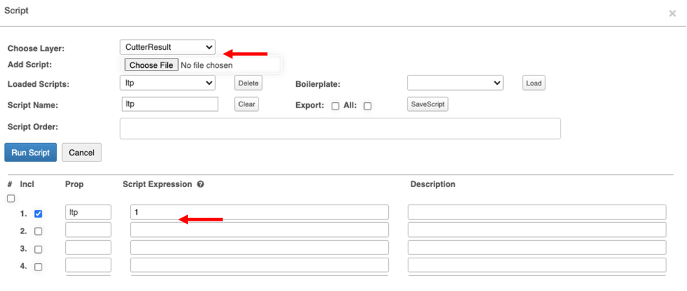

# Chapter 7 Heap Leach Model

What you will learn:

- [Cutter Result Recovery Model Properties](#Cutter-Result-Recovery-Model-Properties)
- [Overview](#Cutter-Result-Recovery-Model-Properties)

### Cutter Result Recovery Model Properties: 

| **Name** | **Summary**|
|-------------------|------------------------------------------------------------------------------|          
|        midx |  Block center point X coordinate (ex. 6501625)                                            
|        midy |  Block center point Y coordinate (ex. 2182875)                                            
|        midz |  Block elevation (ex. 2930)                                                               
|        z    |  Block elevation (ex. 2930 = midz)                                                        
|        type |  What kind of shape it is (always will be fill for modeling)                              
|        pn   |  Property used to sort, combination of pn_gid_z (ex. S3_L1_C6_5x6_2930_)                  
|        gy   |  Numbered grid coordinate Y (ex. 7)                                                       
|        gx   |  Numbered grid coordinate X (ex. 5)                                                       
|        gid  |  Unique property for each block, combination of gx and gy (ex. 5x7)                       
|        seq  |  After sorting, we assign numbers 1 – n where n represents the number of blocks (ex. 11450)  
| swell        |  Used for Ton calculation (should be 1 for most models without Opencontour   
| on           |  Date when the block receives solution, used with ‘lt’ to decide when it turns  
| la           |  Layer type (ex. cr, negligible)                                             
| lt           |  Leach cycle, Days receiving solution (ex. 75)                               
| dens         |  Block density, used in ton calculation (ex. 0.057)                          
| tns          |  Tons of block = vol x dens (ex. 1425)                                       
| area         |  Area of the block = width x height (ex. 2500.00)                            
| vol          |  Volume of the block = vol x area x bench height (ex. 25000)                 
| fi           |  Phase name of the block, assigned through the Filler layer (ex. S3_L1_C6)   
| cut_fill_num |  Filler number from layer menu, (ex. 7)                                      
| dir    |  Direction of stacking of the pad, assigned through the layer menu (ex. 180) 
| ow_min |  Type of ore type (‘ow’) received minimum (ex. 0.5)                       
| ow_max |  Type of ore type (‘ow’) received maximum (ex. 10000                      
| au     |  Grade of gold in block (ex. 0.027056889)                                 
| ag     |  Grade of silver in block (ex. 0.3522071110000001)                        
| imc    |  Initial Moisture Content (ex. 0.08)                                      
| sseq   |  Stacking sequence, used with direction (ex. 3797)                        
| ow     |  Ore type, imported from minplan (ex. 70)                                 
| pm     |  Date block was placed (ex. 44884)                                        
| ltp    |  Leach type (ex. 3)                                                       
| ultimate |  Ultimate from extraction curve (ex. 0.699999988079071_)                  
| on_seq   |  Sorted number used for variance turning blocks on/off (ex. 9371)         
| aum1     |  Metal placed initially (ex. 1199.5086669921876)                          
| aurp1    |  Block recoverable metal placed beginning of model (ex. 839.6558837890625)
| aur1     |  Block metal remaining beginning of model (ex. 458.4161071777344)         
| auer1    |  Block extractable metal remaining beginning of model (ex. 98.5635604858398  
| aufi1    |  Block flowing solution metal inventory at beginning of model (ex. 0)     
| ausi1    |  Block stagnant solution metal inventory beginning of model (ex. 0.30331748  
| aux1     |  Block extraction beginning of model (ex. 0.6178300380706787)             
| aum2     |  Metal placed end of time =aum1 (ex. 1199.5086669921876)                  
| aurp2           |  Block recoverable metal placed end of model = aurp1 (ex. 839.6558837890625  
| aur2            |  Metal remaining at end of model run (ex 58.4161071777344)                
| auer2           |  Total extractable metal remaining at end of model (ex. 98.56356048583985)
| aufi2           |  Flowing solution metal at end of model (ex. 0)                           
| ausi2           |  Stagnant solution metal at end of model (ex. 0.30331748723983767)        
| aux2            |  % Metal extracted at the end of the model run (ex. 0.6178300380706787)     
| flow_out_bottom |  Flow out of the bottom of block at the end of the model run (ex.          
| days_leaching    |  Number of days leaching, includes cut point and slope calculations         
| moisture_content |  Moisture content of last day of model run (ex. 0.13926574587821            
| r_ar             |  Reference application rate (ex. 0.005)                                   
| pm2              |  Date placed block above (ex. 47785)                                   
| pm3              |  Difference between date placed above and current blocks date place (ex. 12) 

## 7.1 Overview

Before going through the Heap Leach Recovery Model (HPL Model), Opencontour recommends the user take a few steps to allow the Model to run without significant hiccups. It is important to highlight that the HPL Model is run after the historical and or forecasted Stacking Plan has been updated and saved.

This user guide assumes that the user will have the most up-to-date Project Settings, with all the project stacking information. 

For more information on setting up your project and Project Properties, please review Chapter 3. 

When setting up an HPL Model, it is important to highlight properties that will need to be reviewed and updated if necessary. Make sure to select your measurement unit, metric or imperial. Opencontour will pre-populate most of these fields with industry-standard data. Make sure to update the Density used for your project. 

BenchHeight: Opencontour discretizes at bench height. Therefore, when selecting your Project Properties bench height, you automatically default set the discretization height. Note: the bench height is typically a fraction of the lift height. For example, a lift height of 10m can have a bench height of 2m. 

## 7.2 Setting-up for a new Heap Leach Recovery Model

### 7.2.1 New Project

Create a new Project by importing your Project Settings, including the most up-to-date Stacking information. Drag & Drop your allfile.json or import your csv “all” file. Go to the proper elevation to view your Base Layer; you can use Q or W, update the elevation in the Project View Settings Bench section, press enter, or Run.

Now you can see all your filler layers used to build the Stacking plan. We use these filler layers to make the lifts, all within your Base Layer (always highlighted in red).

### 7.2.2 Best Practices

Before you start working on the HPL Recovery Model, we recommend that you take the following steps:

<ol type="I">
<li>From the Utility Menu, select the Heap Leach Stacking Module. The Leach Stacking window will default to the Progress Tab.Before the user is able to run the model, all progress icons will need to have a green checkmark; to review the Heap Leach Stacking process and how to get to this point in the process please review Chapter 6 (currently 5).</li>
<li>Check the “For Model” box from the Progress Window and click on Discretize; this will break up all the shapes into entire blocks to fit the model.</li>
</li>
<li>The next step is to import your Mine Plan, and once this takes place, you will be required to Populate the Mine Plan. This will essentially break up the Mine Plan into small blocks that will fit the model created when the data was discretized. Remember that the Model will automatically assign an ltp (leach type) of 1 to the Mine Plan Properties. If you are looking at having multiple ltp designations, open the script utility menu and add/edit scripts.</li>
</ol>

Now that we are confident that our Stacking Plan is in place and all the information needed to run the model has been updated, we can prepare and run the Heap leach Recovery Model.

## 7.3 Prepare and run the Heap leach Recovery Model

Some Projects will require the use of Solution Shapes; if this is the case for your project, please review the following steps; otherwise, move on to step 7.4.

### 7.3.1 If Solution Shapes already exist within your Stacking plan

Activate the Solution Layer (which will turn orange) and select the cycle in which you want to view the Shapes, e.g., All. Click on the Project Window and move up or down the Elevation to view the shapes (Q or W).

### 7.3.2 If Solution Shapes do not exist but need to be added
<ol type="I">
    <li>Create your own solution shapes:</li>
        <ol type="a">
            <li>Select Add Layer, then Add Solution Layer</li>
            <li>Ensure that the solution layer is selected, select the Add Polygon  tool from the toolbar and draw the solution shape. Make sure to double click when the shape is done; this will create the shape and provide Properties such as the on date and lt time (days).</li>
        </ol>
            <li>Create a script to apply leach properties to every model block </li>
    <ol type="a">
        <li>From the Utility Menu, select Scripts and add scripts to each property. There are simple solution scripts within the boilerplate dropdown, but more complex scripts can be created if needed.</li>
    </ol>
</ol>

Now that the Solution Shapes are in place is important that you update and confirm the Properties for the actual Solution Shape. Select the Heap Leach Stacking module from the Utility Menu, then the Solution Tab.

We recommend reviewing the data for your App rate and Leach Time; these two data points would be populated from your Project Settings File.

Click on Update Solution. If you forget to Run the Updated Solution, your Model will not carry the updated information. 

When the Solution is updated, all your CutterResult shapes that have an on and lt and all your solutions shapes are combined and written to your Model Layer. To view the Solution Layers created, activate the Solution Layer and click the “A” key. You will now see the Solutions Shapes within the Model.

### 7.3.3 Adding a Plant
Heap Leach projects will usually have one (1) Plant where the Solution is processed. We recommend adding your plant(s) at this point in the model development process. 

Select Schedule Tool from the Toolbar, then select Add Plant Features. The icon will turn orange when it is active, then click on the project window (outside your grid), the Plant Properties window will appear. Add as many plants as needed, then deactivate the Schedule tool from the toolbar (back to green).

Once a Plant or Barren is created, you can manually update its properties and upload historical data (if applicable) from a CSV file. 

If the project contains historic barren flows and tenors, the user has the option to upload csv file with all the properties. Select the Plant / Pond icon from your drawing window and click to upload a CSV. The Properties window will pop up, select CSV and search for your file. 

Tip: turn your Schedule Layer back on to ensure the number of plants is correct. If you added more than necessary, select the Delete Tool, and remove the ones you no longer need.

Opencontour defaults the Model ltp script to 1, however, we recommend that the user reviews the Model Scripts after adding a Plant(s). Under the Utility Menu, select Script. The Software will default the rows to which Scripts were added during the Project Settings. It is recommended that we always load scripts from Row 1 onwards.

<ul>
 <li>Choose Layer &rarr; CutterResult</li>
 <li>Prop (Properties) &rarr; ltp(Leach Type)</li>
 <li>Script Expression &rarr; 1(Default)</li>
</ul>

<ol>If more than one (1) ltp Properties were added, update and Run Script, and you will be prompted with information on how many scripts were calculated. Click ok. Then Close the Script Window. Otherwise, close the window.</ol>

### 7.3.4 Adding a Pond

Select the Schedule tool from the toolbar, then Add Pond. Back in your Solution Layer, you will see a new Option called “raincoat” selected under the Cycle dropdown menu. 

Select Add Polygon and draw the shape; double click to create the shape and list Properties. It is important that you add on and lt properties to your Pond.

## 7.4 Heap Leach Recovery Model

From the utility menu, select Heap Leach Recovery; the following window will default to Inputs. It is recommended that you review and adjust, if necessary, the number of dates you wish to run the model for. The number of days will impact the speed to run your model.

We also recommend checking your inputs, especially if this is the first time running the model. Inputs were uploaded as part of your Project Setting setup; however, these can be manually updated. Remember to save your project with a new name and let other users know about changes (if using the same files).

### 7.4.1 Inputs

Here, you will find static inputs on a block-to-block basis (all blocks share these properties) and control inputs for the model duration.

#### <em>Inputs Global Definitions</em>
| **Input**    | **Definition**|
|--------------|-------------------------------------------------------------------------------------------------------------------------------------------------------------------------------------------------------------------------------|
| Start        | Start date for the Model to run from – taken from the earliest block placed, no user input required.|
| Run Duration | Length in days the model will run for. Updating the Run Duration will automatically update the End Date.**|
| End          | End date the model will run for. Updating the End input will automatically update the Run Duration.|
| Time Step    | The interval between model calculations, measured in days. Opencontour is set up to default Time Step to 1, meaning daily. The user has the capability to edit this field and update it every two days (2), weekly (7), etc.  |

<ol>**We recommend adjusting the number of days to reflect a shorter period unless the user requires all data at once. </ol>

#### <em>Inputs Operational Definitions</em>

| **Input**                  | **Definition**      |
|----------------------------|-----------------------------------------------------------------------------------------------------------------------------------------------------------------------------------------------------------------------------------------------------------------------------------------------------|
| Flowing Solutions Fraction | A calibration factor that represents the percent of solution moving between vertical blocks. 20% is the tested field standard. The majority of leach models will not need to adjust this number. Further definition and research can be provided by Opencontour/Forte if requested.                 |
| Mass Transfer Coefficient  | A calibration factor that represents the speed at which gold particles transfer into the flowing solution. 0.05 is the tested field standard. The majority of leach models will not need to adjust this number. Further definition and research can be provided by Opencontour/Forte if requested.  |
| Dry Ore Bulk Density       | Density of each cutter result block.|
| Leach Capacity             | The steady state gravimetric moisture content when the ore is being leached, based on lab data  and heap leaching methodology calculation for unsaturated flows. This can be provided by Forte based on analysis of lab data and other ore properties|
| Field Capacity             | The residual gravimetric moisture content, based on lab data. Typically found from compacted permeability testing.|

#### <em>Grid Parameters Definitions</em>
| **Input** | **Definition**           |
|-----------|---------------------------|
| Width     | Width of each grid cell   |
| Length    | Height of each grid cell  |
| Area      | Area of each grid cell    |

#### <em>Extraction Delay by Depth</em>

| **Input** | **Definition**|
|-----------|------------------------------------------------------------------------------------------------------------------------------------------------------------------------------------------------------------------------------------------------------------------------|
| Cut Point | Scientific factor that simulates extraction delay by depth. 300 feet or 100 meters is the tested field standard. The majority of leach models will not need to adjust this number. Further definition and research can be provided by Opencontour/Forte if requested.  |
| Slope     | Scientific factor that simulates extraction delay by depth. 3 is the tested field standard. The majority of leach models will not need to adjust this number. Further definition and research can be provided by Opencontour/Forte if requested.|

####	<em>Draindown</em>
| **Input**           | **Definition**|
|---------------------|-----------------------------------------------------------------------------------------------------------------------------------|
| Closure             | Date to apply closure logic. Further detail of closure logic can be provided by Opencontour/Forte                                 |
| Discharge Flow Rate | Flowrate to treatment facility applied at the closure date. Further detail of closure logic can be provided by Opencontour/Forte  |

####	<em>Write State </em>

This feature allows the user to run the Model using a Write State, meaning up to a certain point in time, then pause. When a large model is run to a specific timestamp (“Write State”), all block parameters are stored so that concurrent runs start from that date. This feature can be used when combining historical and forecasted stacking data, or running iterations after a certain specified date. 

The user can save all inputs at any time during the Project. However, we recommend that if Write State has been used, or if any inputs are updated and differ from the original project settings, the user exports the CVS file and saves it. We also recommend discussing how to name and save these files with your team before you save and upload updated information.

More details can be found in <em>Chapter 7.8</em>.

### 7.4.2 Systems

Contains any data stored as an array (time series data), whether that is climate, barren tenor, or barren flows. Shows each 'icon' (Plant, Pond, or Leach) added to the Schedule layer and any data used in the model from that icon. 

| **System** | **Name of the system (leach, pond, plant)**|
|------------|-------------------------------------------------------------------------------------------------------------|
| Data       | Headers imported from a time series .csv (leaching_I, unleaching_I, unloaded_I, barren_flow, barren_tenor)  |
| Ranges     | Min/Max dates of the system's data|
| Dropdown   | You can view multiple system's data through a chart|

Some Projects will have Climate Data. If this is the case for your project, please review the following steps; otherwise, move on to step 7.5

#### <em>Adding Climate Data</em>

Opencontour recommends the following Column header and formatting when creating a Climate Properties CSV file.

All inputs other than the date will need to be defined as metric or imperial.

| **Unit of Measurement ** | ** **            |
|--------------------------|------------------|
| Metric                   | millimeters/day  |
| Imperial                 | inches/day       |

To import your project climate data:

<ul>
 <li>Select the Schedule Layer, then the Schedule Tool, then Add Leach. Click in your Project Window. A new icon will appear in your Project Window. Click on it to view its properties. </li>
 <li>From the Properties window, you will upload the CSV or manually update information.</li>
</ul>

## 7.5 Extraction Kinetics

Contains the extraction curves for each ore type (ow) showing the extraction rate for each ore type. The ow designation for each placed block will be associated with the Mine Plan. The user can add the extraction equations here. Values are manually added to each ow. New ore types can be added in the text window. The Ore Type Designation property must be associated with the ow from the mine plan in order to connect the curves to the blocks within the model. 

| **Name**             | **Definition**|
|----------------------|------------------------------------------------------------------------------------------------------------------------------------------------------------------|
| Name Dropdown        | Type in a name to add an extraction curve|
| Ultimate             | The ultimate extraction value for that ore type, based on metallurgical test data.|
| a                    | A rate factor for the extraction equation, based on metallurgical test data. Opencontour/Forte can provide tools to create these equations based on test data.   |
| b                    | A rate factor for the extraction equation, based on metallurgical test data. Opencontour/Forte can provide tools to create these equations based on test data.   |
| Ore Type Designation | This property (must be a number) will match the 'ow' property from the Mine Plan to correlate the extraction curves.|

Once all inputs are in place, save all Ore Extraction Inputs.  Select Save and Export the new json File. Again, we recommend discussing with your team the process of how to name and save these files before you save, and upload updated information. You should now be able to upload the new file to your project using the Upload function within the Extraction Kinetics Menu. 

Note: By Saving you will Save all the leach model menu information at this point and not just the Input Kinetics. 

All graphs can be updated to suit the user’s needs. Opencontour allows for simpler modifications within the Software or by editing data using third-party Cloud Software Plotly. 

## 7.6 Leach Type App Rate

In this Tab you will find inputs that can change from block to block or throughout time.

| **Name** | **Definition**|
|-------------------------------------------------|-----------------------------------------------------------------------------------------------------------------------------------------------------------------------------------------------|
| ltp                                             | Leach Type. Used to group blocks and assign specific properties (historic vs forecast, different initial moisture contents, ROM vs Crush, applied app rates, etc.).|
| imc                                             | Initial Moisture Content of a block in decimal format (e.g. 0.05 for a 5% initial moisture content.|
| r_ar                                            | Reference application rate (L/m2/hr or gpm)|
| ar                                              | Application Rate (L/m2/hr or gpm.|
| ar_v                                            | Application Rate Variance, used when the Modify Application Rate checkbox is checked and is the percentage the app rate is allowed to change in decimal format (e.g. 0.3 is a 30% variance).  |
| outfl                                           | Assign where the pad drains to throughout time, based on each block's days leaching.|
| infl                                            | Assign where the pad receives solution throughout time, based on each block's days leaching.|
| Write properties to CutterResult based on 'ltp' | Writes the table property information to each CutterResult grouped by 'ltp'|

The first step is to assign manual values to: ltp, imc, r_ar, ar, and ar_v.

When assigning the value to your ltp, remember that this number(s) is exclusive and unrelated to the Designation number given to your plant or pond. 1 = Rom, 2 = Crushed

Typical model operation will have the Modify Application Rate checked. Once plant ramp up is achieved and the Target Flow Rate (Q_tar) is met, the application rate will vary within the bounds of the ar_v and the plant flow rate will remain constant. Q_tar and designation properties are set within the plant icon. 

When all these inputs are listed make sure to “Write properties to CutterResult based on ltp” by clicking the associated button.

Now assign your Outflows and Inflows. For each Column & Row select “Assign”.

### 7.6.1 Outflows

Before you start updating the inputs for your Solution Outflows make sure to check the Designation. If your project has more than one plant or pond, and different timelines you will be required to add rows. Example:

| **Start Date (# of days)** | **End Date (# of days)** |
|----------------------------|--------------------------|
| 90                         | 119                      |
| 60                         | 89                       |
| 30                         | 59                       |
| 0                          | 29                       |

###	7.6.2 Inflows

Before you start updating the inputs for your Solution Inflows make sure to check the Designation. If your project has more than one plant or pond, and different timelines you will be required to add rows. Q_tar (Q_target) can only be updated under the Properties for each Plant or Pond. If you need to edit this input, close this window, go back to your Project Window, and double click on your Plant or pond icon, or select the Properties tool from the toolbar. Example:

| **Start Date (# of days)** | **End Date (# of days)** |
|----------------------------|--------------------------|
| 90                         | 119                      |
| 60                         | 89                       |
| 30                         | 59                       |
| 0                          | 29                       |

If your project has more than one ltp, then the sum of both inflows (1 and 2) is what the project is targeting the sum of both running at the same time, in the designated units for the whole pad.

Now it’s time to write these properties to the CutterResult based on ltp” by selecting this icon, then Save.

## 7.7 Running Heap Leach Recovery Model

If all steps have been completed and all Solutions Layers Properties containing on and lt properties have been updated you are now ready to Run the Model.

While in the Heap Leach Recovery Model, you can run the model from any tab.

## 7.8	Using the Write and Read State function for larger models.

Some projects will require additional data to be added to an existing large model.  This addition could be a monthly or weekly actual leach stacking update or can be a forecasted stacking plan. When a large model is run to a certain timestamp (“Write State”), all block parameters are stored so that concurrent runs start from that date. We will now describe the necessary steps required to add the data to the model. 

1. Run the existing model using the “write state” function: Once calibration has been completed, determine the last date you want to run your model for, with the ‘Write State’ checked, Run the model (note this date will be the starting date for this file, rather than the minimum ‘pm’.  This will save each CutterResult’s “state” at the end of the model run. This includes saving properties like flow out, days leaching, extractable metal remaining, cumulative metal realized, cumulative applied/drainage flows. Additionally, a grouped .JSON file will be saved; persisting any historic data.  The user is now able to use this new file for future work, such as forecasts stacking when they need to create more fillers or can continue work on this instance creating more filler shapes.  
2. Either working on this instance, or a separate one, the user will now need to check the ‘Read State’ to tell    the model to pick up where our last model run left off. Notice that when we run the model with the ‘Read State’ checked, a dotted red line appears marking the last run model date. Additionally, we display the dates that the model was last run at the top of the screen (from and to).  

To summarize, to start any model run where the save will be read or wrote we must first start by checking the “Write State”, the user can either continue working on their file or work on the saved group file later.  Now that this base model has been run, the user will only need to check “Read State” to continue where the last model left off. The user can also use both check boxes together to continuously append the reported values.

## 7.9 Combining historical data with future updates (forecast)

The user will be required to follow steps outlined under Chapter 7.8 including saving the grouped .JSON file.

Create a new stacking plan:  A stacking plan can be created from the “Write/Read State” date as a separate file.  This can be a monthly historical update, or it can be a forecasted stacking.  
1.	Use the new group .json file from the larger model as the starting Base topography for this new stacking so that there are no gaps.  
2.	Follow the historical or forecast stacking instructions.  
3.	Save this file with descriptions, for example [YYMMDD]_pad1_stacking_all.json  
4.	Save the CutterResult layer as a separate file for import, not the larger model.Save this file with descriptions, for example: [YYMMDD]_pad1_stacking_cr.json  
5.	Save any solution shapes as a separate file: [YYMMDD]_pad1_stacking_solution.json  

### 7.9.1 Import the CutterResult file into the existing model

The new stacking dataset (CutterResult) will be appended to the existing model.  

Select the “Misc” tab in the Leach Stacking Menu to import the CutterResult file (“Rehandled CutterResult”).

If blocks have been rehandled to make new room for the new stacking, the old blocks will be deleted and replaced with the new stacking.

Use the Script tool to populate the ‘ltp’ property in the CutterResult layer. After you click Ok, exit the window.

Append the new solution shapes by dragging the new solution file into the solution layer.

Back to the Utility menu, select Stacking Module and under the Solution tab, run the “Update Solution” function to populate the model layer with the newest solution polygons.

After running the model (for more information on how to Run the Model go to <em>Chapter 7.7</em> ), the new data will be cumulative for the whole pad. Data can be exported into Excel for further analysis.