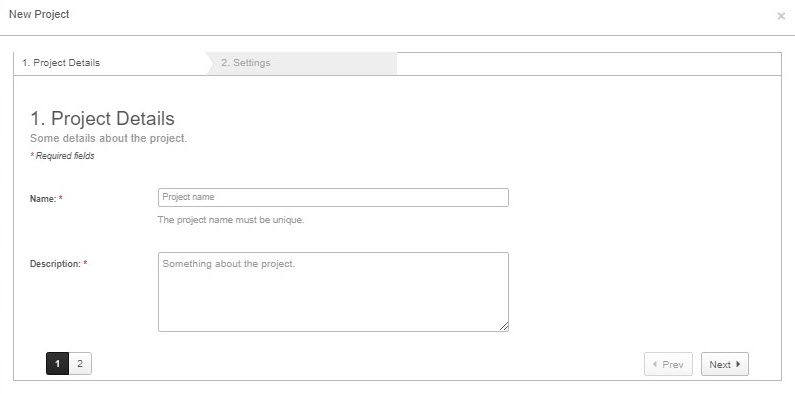
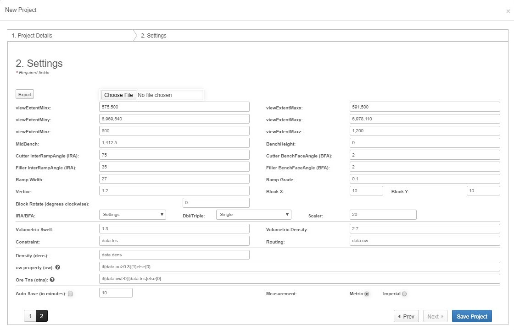

# Chapter 3 Setting Up a Project

<video width="70%" height="300px" style="margin-left:3em;" controls>
    <source src="../images/videos/project_setup.mp4" type="video/mp4">
    <!-- <source src="assets/videos/favicon.png" type="video/ogg"> -->
    Your browser does not support the video tag.
</video>

What you will learn:

- [Project Dashboard](#project-dashboard).
- [Setting up a Project for a New User](#setting-up-a-project-for-new-user).
- [Setting up a Project for Existing Users](#setting-up-a-project-for-existing-user).
- [Hot Keys](#hot-keys).
- [Supported File Types](#supported-file-type).
- [Reload Project](#reload-project).
- [Basic Mine Plan Workflow](#basic-mine-plan-workflow).

____________________________________________________________________

### Project Dashboard

The project dashboard displays a list of recent projects, along with their descriptions and creation dates. For new users, the projects list will be initially empty. If you are an existing user, you can view the list of projects.

### Setting up a Project for New User

1. Click the **New Project** button in the upper right corner. A new window will appear.

    
&nbsp;

2.	Enter the Project Name and Description of the project.

3.	Click **Next**. A Settings window with configuration options will appear.

    

    **NOTE: The parameters are pre-populated with default values and should be adjusted for your project.**

    The project settings page also provides you with the ability to import values from another project and export data from the current project's configuration. 
    To import values, click the **Choose File** button. The entries will be instantly updated. Click the **Export** button to save the entries for later use in another project.

    **NOTE: Only the JSON format is supported for storing the values. The Project Settings window entries are stored in the database for the entire project.**

4. If you are a new user and do not have access to a JSON file, please enter the details in the following fields:

    **Drawing Window Settings**
   
    |   Settings Property       |   Default   |&nbsp;&nbsp;Description |
    | :------------: | :---------------: | :----- |
    | viewExtentMinx |   575500       |The minimum viewing extent allowed in the X direction.   | 
    | viewExtentMaxx |   591500       |  The maximum viewing extent allowed in the X direction.    | 
    | viewExtentMiny |   6969540       |  The minimum viewing extent allowed in the Y direction.     | 
    | viewExtentMaxy |   6978110       |  The maximum viewing extent allowed in the Y direction.       | 
    | viewExtentMinz |   800       |  The minimum viewing extent allowed in the Z direction.       | 
    |   viewExtentMaxz |   1200       |  The maximum viewing extent allowed in the Z direction.         | 
    |   MidBench* |   1412.5       |  The middle bench elevation selected as the active mid bench to be displayed when opening the new project.  This mid bench entry will also determine the consistent catch bench locations for Double, Triple & Quad mid benches.| 
    |   BenchHeight |   9       |  The bench height should be set to the vertical intervals between the Mid bench contours      | 
    |   Cutter InterRampAngle (IRA) |   75      |  The pit wall angle formed to from either toe to toe or crest to crest, exclusive of ramps.  Inter Ramp angle (IRA) to be used if IRA/BFA is set to Settings.| 
    |   Cutter Bench Face Angle (BFA) |   1200       |  Bench Face angle (BFA) to be used for the Cutter layers if IRA/BFA is set to Settings. This is the Settings BFA used for Dbl/Triple/Quad options and Toe/Crest builds.| 
    |   Filler InterRampAngle (IRA) |   75       |  The Filler (dumps, leach pad cells) wall angle formed to from either toe to toe or crest to crest, exclusive of ramps.  | 
    |   Filler Bench Face Angle (BFA) |          |  Bench Face angle (BFA) to be used for the Filler layers if IRA/BFA is set to Settings. Not used when Single benching (Dbl/Triple option).  | 
    |   Ramp Width |   27       |  Width of the ramp to be constructed  | 
    |   Ramp Grade |   0.1       |  Gradient of the ramp to be constructed, equal to Rise/Run. 10% = 0.1.  Calculated from the middle of the ramp. | 
    |   Vertice* |   1.2     |  Controls the distance for which vertices are reduced/added when using the Main Menu buttons.  The value refers to the distance between the vertices.  Used for Modify Number of Feature Vertices button, and the Create curve button function.  | 
    |   Block X |   10       |  Block size in the X direction, from the block Model file.     | 
    |   Block Y|   10       |  Block size in the Y direction, from the block Model file.      | 
    |   Block Rotate (degrees clockwise)|   0       |  Used for rotated block Models from the block Model file.   | 
    |   IRA/BFA*|   Settings    |  Wall angle value used. Either Settings (Uses the Project Settings’ InterRampAngle (IRA) and Bench Face Angle (BFA) value for multiple benches) or the Geotech layer domain settings.    | 
    |   Dbl/Triple*|   Single    |  The Dbl/Triple feature projects upwards at the BenchHeight by one contour using the Cutter InterRampAngle (IRA) when the Single option is chosen.  The selected contour is projected upwards twice when the option Double is selected with builds two horizontal berms between the contours.  The first contour uses the BFA, the second uses the IRA (in the Project Settings, Model or Geotech).  For the Triple option, three contours are built (three berms), four for the Quad option, with four contours.   | 
    |   Scaler* |   20      |  The radius of the red Scaler circle is determined by the number written in the box. | 

    &nbsp;

    **Schedule Settings**

    |   Settings Property       |   Default   |&nbsp;&nbsp;Description |
    | :------------: | :---------------: | :----- |
    | Volumetric Swell |   1.3       |Swell of the material to be used to calculate filler tns values.  The filler uses this value as material ‘swells’ by this factor.  Cutter layers do not use this factor  | 
    | Density - mass/volume (ton/ft3 or t/m3) |   2.7      |The density of the Filler material is used as a default when using the Dropdown Menu‘s, Display/Volumetric/Detail function. The Mineplan will use a block model value for density. Density values entered should have the units tns/volume.  | 
    | Constraint* |   data.tns       |The Mine Constraint quantity of each block available for scheduling.  Generally, the schedule uses tns (data.tns) or truck calendar hours (data.trch) to schedule.    | 
    | Routing* |   data.ow       |The property is the value used to send a block to a stockpile for processing, a leach pad, or the waste dump.  This variable is usually the data.ow value    | 

    &nbsp;

    **buildMineplan Settings**

    |   Settings Property       |   Default   |&nbsp;&nbsp;Description |
    | :------------: | :---------------: | :----- |
    | Density (dens)  |   data.dens       |Density property in the Model layer to use for calculating block tonnage.  This is used and written to the Mineplan blocks, referring to number of the Model.  Density values in the Model layer should have the units tns/volume.  | 
    | ow property(ow)* |   if(data.au>0.1){1}else{0}       |JavaScript equation used in the Mineplan block to determine if a block is ore or waste (> 0 = ore) | 
    | Ore Tons (otns)* |   if(data.ow>0){data.tns}else{0}       |JavaScript equation used to calculate Ore tonnage.  Allows for use if using partial blocks, etc., e.g. if(data.ow>0){data.tns*data.oreper/100}else{0} | 
    | Auto Save (in minutes) |   tickbox unchecked       |Interval to create a backup of the All (Model) group file (includes the Model layer), with a unique name (April 11, 2019-09.41.00AM_pit1_all_backup.json) in a directory prompted by the user.  Project is set to save every 10 minutes, but box is unchecked by default.  Ticking the box enables this function.     | 
    | Measurement |   Metric radio button active       |  Measurement system (Imperial or Metric) to be used for the project.  Calculations will differ for truck speeds (km/hr or mph).| 

&nbsp;
5.	Click **Save Project** button to save the setup and begin working on the new project.

### Setting up a Project for Existing User

1.	In the dashboard, existing users can see a list of all the projects that they are currently working on.

    
&nbsp;

2.	To proceed with a project, select it from the list. It will direct you to the project's page.    
