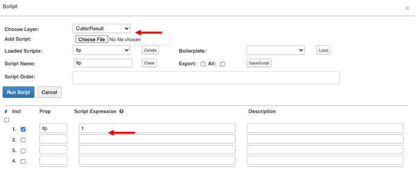

# Capítulo 7 Modelo de apilamiento de lixiviación en pilas

What you will learn:

- [Visión General](#Vision-General)
- [Cutter Result Recovery Model Properties](#Cutter-Result-Recovery-Model-Properties)
- [Overview](#Cutter-Result-Recovery-Model-Properties)

## 7.1 Visión General

Antes de empezar con el modelo de recuperación de lixiviación en pilas (modelo HPL), Opencontour recomienda que el usuario siga algunos pasos para permitir que el modelo se ejecute sin mayores contratiempos. Es importante destacar que el modelo HPL se ejecuta después de que el plan de apilamiento histórico y/o previsto se haya actualizado y guardado.

Esta guía del usuario asume que el usuario tendrá la configuración del proyecto más actualizada, con toda la información de apilamiento del proyecto.

Para obtener más información sobre la configuración del proyecto y las propiedades del proyecto, consulte el Capítulo 3.

Al configurar un modelo HPL, es importante resaltar las propiedades que deberán revisarse y actualizarse si es necesario. Asegúrese de seleccionar su unidad de medida, métrica o imperial. Opencontour rellenará previamente la mayoría de estos campos con datos estándar de la industria. Asegúrese de actualizar la densidad utilizada para su proyecto. Además, asegúrese de que el valor 'Oleaje volumétrico' para el proyecto esté establecido en 1.

Altura del banco (Bench Height): Opencontour discretiza a la altura del banco. Por lo tanto, al seleccionar la altura del banco las propiedades del proyecto, la altura de discretización se establece automáticamente en el mismo valor.

NOTA: la altura del banco suele ser una fracción de la altura de elevación. Por ejemplo, una altura de elevación de 10 m puede tener una altura de banco de 2 m.

## 7.2 Configuración de un nuevo modelo de recuperación de lixiviación en pilas

### 7.2.1 Nuevo proyecto

Cree un nuevo proyecto importando la configuración del proyecto, incluida la información de apilamiento más actualizada. Comience arrastrando y soltando su archivo '_all.json' en la ventana del proyecto. Vaya a la elevación adecuada para ver la capa base; puede usar Q o W, actualizar la elevación en la sección Banco (Bench) de configuración de la vista del proyecto, presionar Enter o Ejecutar (Run).

Ahora puede ver todas las capas de relleno utilizadas para crear el plan de apilamiento. Utilizamos estas capas de relleno para hacer los levantamientos, todo dentro de su capa base (siempre resaltado en rojo).

### 7.2.2 Prácticas recomendadas

Antes de empezar a trabajar en el modelo de recuperación hpl, le recomendamos que siga estos pasos:

<ol type="I">
<li>En el menú Utilidad, seleccione el módulo de apilamiento de lixiviación en pilas. La ventana Apilamiento de lixiviación tendrá como valor predeterminado la ficha Progreso. Antes de que el usuario pueda ejecutar el modelo, todos los iconos de progreso deberán tener una marca de verificación verde; para revisar el proceso de apilamiento de lixiviación en pilas y cómo llegar a este punto en el proceso, revise el Capítulo 5</li>
<li>Marque la casilla "Para el modelo" (For Model) de la ventana de progreso y haga clic en Discretizar; esto dividirá todas las formas en  bloques completos para que se ajusten al modelo.</li>
</li>
<li>El siguiente paso es importar su plan de mina a través de un formato CSV o 'model.jason'. Una vez que esto ocurra, se le pedirá que Llene el Plan de Mina (populate mine plan). Esto esencialmente dividirá el Plan minero en pequeños bloques que se ajustarán al modelo creado cuando se discretizaron los datos.  Recuerde que el Modelo asignará automáticamente un ltp (tipo de lixiviación) de 1 a las Propiedades del Plan de Mina. Si está buscando tener varias designaciones ltp, abra el menú de la utilidad de script y agregue / edite scripts.</li>
</ol>

Ahora que estamos seguros de que nuestro Plan de apilamiento está en su lugar y toda la información necesaria para ejecutar el modelo se ha actualizado, podemos preparar y ejecutar el Modelo de recuperación de lixiviación en pilas.

## 7.3 Preparar y ejecutar el modelo de recuperación de lixiviación en pilas

Algunos proyectos requerirán el uso de formas de solución; si este es el caso de su proyecto, revise los siguientes pasos; de lo contrario, continúe con el paso 7.4.

### 7.3.1 Si las formas de solución ya existen en el plan de apilamiento

Active la capa de solución (solution layer) (que se volverá naranja) y seleccione el ciclo en el que desea ver las formas, por ejemplo, Todo. Haga clic en la ventana del proyecto y suba o baje la elevación para ver las formas (Q o W).

### 7.3.2 Adición de solución al modelo
<ol type="I">
    <li>Cree sus propias formas de solución:</li>
        <ol type="a">
            <li>Seleccione Agregar capa (Add Layer) y, a continuación, Agregue capa de solución (Solution Layer)</li>
            <li>Asegúrese de que la capa de solución está seleccionada, seleccione la herramienta Agregar polígono   en la barra de herramientas y dibuje la el polígono de la solución. Asegúrese de hacer doble clic cuando la forma esté terminada; esto creará la forma y proporcionará propiedades como la fecha de inicio y el periodo lt (días).</li>
        </ol>
            <li>Crear un script para aplicar propiedades de lixiviación a cada bloque de modelo /li>
    <ol type="a">
        <li>En el menú Utilidad, seleccione Scripts y agregue scripts a cada propiedad. Hay scripts de solución simples dentro del menú desplegable repetitivo, pero se pueden crear scripts más complejos si es necesario. </li>
    </ol>
</ol>

Ahora que la información de la solución está en Capa Menu, es importante actualizar la capa del modelo. Seleccione el botón **Actualizar solución** (Update Solution) del módulo Modelo de recuperación de lixiviación en pilas del menú Utilidad de la ficha progreso. El usuario puede optar por **Add BreakThrough Time** en los polígonos de solución que existen en la capa de solución. Si el proyecto tiene bloques CutterResult que tienen propiedades **on y lt** escritas en ellos a través de un script, la solución actualizada (Update Solution) junto con la función **Add BreakThrough Time** anexará los días que tarde en pasar en función de las entradas globales del proyecto y la distancia al revestimiento.

Te recomendamos que revises los datos de la tasa de aplicación  (App Rate) y el tiempo de lixiviación (Leach Time) Tasa de aplicación (App Rate) es el campo 'ar' en la tabla de la pestaña Solución en el menú Modelo de recuperación. El tiempo de lixiviación se trata en la capa de solución.

Cuando se actualiza la solución, todas las formas de CutterResult que tienen un on y lt y todas las formas de soluciones se combinan y se escriben en la capa del modelo. Para ver las capas de solución creadas, active la capa de solución y haga clic en la clave "A". Ahora verá las formas de soluciones dentro del modelo.

### 7.3.3 Agregar una planta
Los proyectos de lixiviación en pilas generalmente tendrán una (1) planta donde se procesa la solución. Recomendamos agregar su(s) planta(s) en este punto del proceso de desarrollo del modelo.

Seleccione Herramienta de programación (Schedule tool) en la barra de herramientas y, a continuación, seleccione Agregar características de planta (Plant Properties). El icono se volverá naranja cuando esté activo, luego haga clic en la ventana del proyecto (fuera de su cuadrícula), aparecerá la ventana Propiedades de la planta. Agregue tantas plantas como sea necesario y, a continuación, desactive la herramienta Programar de la barra de herramientas (volver a verde).

Una vez que se crea una planta, puede actualizar manualmente sus propiedades y cargar datos históricos (si corresponde) desde un archivo CSV.

Si el proyecto contiene flujos y tenores estériles históricos, el usuario tiene la opción de cargar el archivo csv con todas las propiedades. Seleccione el icono Planta / Estanque en su ventana de dibujo y haga clic para cargar un CSV. Aparecerá la ventana Propiedades, seleccione CSV y busque su archivo.

Opencontour recomienda los siguientes encabezado de columna y formato al crear un archivo CSV de propiedades de planta / estanque:

Consejo: vuelva a activar la capa de programación para asegurarse de que el número de planos sea correcto. Si agregó más de lo necesario, seleccione la herramienta Eliminar y elimine las que ya no necesite.

Opencontour establece de forma predeterminada el script Model ltp en 1, sin embargo, recomendamos que el usuario revise los Model Scripts después de agregar uns planta(s) (Plant(s)). En el menú Utilidad, seleccione Script. El Software establecerá de forma predeterminada las filas a las que se agregaron scripts durante la configuración del proyecto. Se recomienda que siempre carguemos scripts desde la fila 1 en adelante.

<ul>
 <li>Elija la capa &rarr; CutterResult</li>
 <li>Prop (Propiedades) &rarr; ltp(Tipo de lixiviación)</li>
 <li>Expresión de script  &rarr; 1(Predeterminado)</li>
</ul>

<ol>Si se agregaron más de una (1) propiedades ltp, actualice y ejecute (run) el script, y se le pedirá información sobre cuántos scripts se calcularon. Haga clic en Aceptar. A continuación, cierre la ventana de script. De lo contrario, cierre la ventana.</ol>

### 7.3.4 Agregar un estanque

Seleccione la herramienta Programar (Schedule) en la barra de herramientas y, a continuación, Agregar estanque (add pond). De vuelta en su capa de solución, verá una nueva opción llamada "impermeable" seleccionada en el menú desplegable Ciclo (cycle).

Seleccione Agregar polígono y dibuje la forma; haga doble clic para crear la forma y la lista Propiedades.  Es importante que agregue propiedades y lt a su estanque.

## 7.4 Modelo de recuperación de lixiviación en pilas

En el menú de la utilidad, seleccione Recuperación de lixiviación; la siguiente ventana tendrá como valor predeterminado Entradas (inputs). Se recomienda que revise y ajuste, si es necesario, el número de fechas para las que desea ejecutar el modelo. El número de días afectará la velocidad para ejecutar su modelo.

También recomendamos verificar sus entradas, especialmente si es la primera vez que ejecuta el modelo. Las entradas se cargaron como parte de la configuración de la configuración del proyecto; sin embargo, estos se pueden actualizar manualmente. Recuerde guardar su proyecto con un nuevo nombre e informar a otros usuarios sobre los cambios (si usa los mismos archivos).

### 7.4.1 Entradas (Inputs)

Aquí, encontrará entradas estáticas de bloque a bloque (todos los bloques comparten estas propiedades) y entradas de control durante la duración del modelo.

#### <em>Definiciones globales de inputs</em>
| **Entradas(Input)**    | **Definición**|
|--------------|-------------------------------------------------------------------------------------------------------------------------------------------------------------------------------------------------------------------------------|
| Start        | Fecha de inicio desde la que se ejecutará el modelo: tomada del propiedad 'pm' más antiguo colocado, no se requiere la entrada del usuario.|
| Run Duration | Duración en días en que se ejecutará el modelo. La actualización de la duración de la ejecución actualizará automáticamente la fecha de finalización.**|
| End          | Fecha de finalización para la que se ejecutará el modelo. La actualización de la entrada final actualizará automáticamente la duración de la ejecución. |
| Time Step    | El intervalo entre los cálculos del modelo, medido en días. Opencontour está configurado para que el paso de tiempo predeterminado sea 1, es decir, diario. |

<ol>**Recomendamos ajustar el número de días para reflejar un período más corto a menos que el usuario requiera todos los datos a la vez. </ol>

#### <em> Entradas Definiciones Operativas </em>

| **Entradas(Input)**    | **Definición**|
|----------------------------|-----------------------------------------------------------------------------------------------------------------------------------------------------------------------------------------------------------------------------------------------------------------------------------------------------|
| Flowing Solutions Fraction | Un factor de calibración que representa el porcentaje de solución que se mueve entre bloques verticales. El 20% es el estándar de campo probado. La mayoría de los modelos de lixiviación no necesitarán ajustar este número. Opencontour/Forte puede proporcionar más definición e investigación si así lo solicita.    |
| Mass Transfer Coefficient  | Un factor de calibración que representa la velocidad a la que las partículas de oro se transfieren a la solución que fluye. 0.05 es el estándar de campo probado. La mayoría de los modelos de lixiviación no necesitarán ajustar este número. Opencontour/Forte puede proporcionar más definición e investigación si así lo solicita.|
| Dry Ore Bulk Density       | Densidad de cada bloque de resultados de corte.|
| Leach Capacity             | El contenido de humedad gravimétrica en estado estacionario cuando el mineral está siendo lixiviado, basado en datos de laboratorio y cálculo de la metodología de lixiviación en pilas para flujos insaturados. Esto puede ser proporcionado por Forte basado en el análisis de datos de laboratorio y otras propiedades del mineral.|
| Field Capacity             | El contenido de humedad gravimétrica residual, basado en datos de laboratorio. Por lo general, se encuentra a partir de pruebas de permeabilidad compactadas.|

#### <em>Definiciones de Parámetros de Cuadrícula</em>
| **Entradas(Input)**    | **Definición**|
|-----------|---------------------------|
| Width     | Ancho de cada celda de cuadrícula   |
| Length    | Altura de cada celda de cuadrícula  |
| Area      | Área de cada celda de cuadrícula    |

#### <em>Retraso de Extracción por Profundidad</em>

| **Entradas(Input)**    | **Definición**|
|-----------|------------------------------------------------------------------------------------------------------------------------------------------------------------------------------------------------------------------------------------------------------------------------|
| Cut Point | El factor científico que simula el retraso de extracción por profundidad. 300 pies o 100 metros es el estándar de campo probado. La mayoría de los modelos de lixiviación no necesitarán ajustar este número. Opencontour/Forte puede proporcionar más definición e investigación si así lo solicita.  |
| Slope     | Factor científico que simula el retraso de extracción por profundidad. 3 es el estándar de campo probado. La mayoría de los modelos de lixiviación no necesitarán ajustar este número. Opencontour/Forte puede proporcionar más definición e investigación si así lo solicita.|

####	<em>Drenaje</em>
| **Entradas (Input)**    | **Definición**|
|---------------------|-----------------------------------------------------------------------------------------------------------------------------------|
| Closure             | Fecha para aplicar la lógica de cierre permanente. Opencontour/Forte puede proporcionar más detalles de la lógica de cierre.   |
| Discharge Flow Rate | Caudal a la instalación de tratamiento aplicado en la fecha de cierre. Opencontour/Forte puede proporcionar más detalles de la lógica de cierre. |

####	<em> Write State </em>

Esta característica permite al usuario ejecutar el modelo utilizando Write State, es decir, hasta un cierto punto en el tiempo, luego hacer una pausa. Cuando un modelo se ejecuta en una marca de tiempo específica ("Write State"), todos los parámetros de bloque se almacenan para que las ejecuciones simultáneas comiencen a partir de esa fecha. Esta característica se puede utilizar al combinar datos de apilamiento históricos y pronosticados, o al ejecutar iteraciones después de una fecha especificada determinada.
Esta funcionalidad hace las siguientes suposiciones:
1.	El usuario ha pasado por el módulo de apilamiento hasta la finalización,
2.	El usuario ha escrito las propiedades lt y on en la capa del modelo.
Para confirmar que esto se ha hecho, seleccione el Modelo en el menú desplegable de la etiqueta y seleccione en la propiedad. La información que se muestra en la ventana del proyecto confirmará el número de veces que la columna del modelo específico recibirá la solución a lo largo de la ejecución del modelo.
  
El usuario puede guardar todas las entradas en cualquier momento durante el proyecto. Sin embargo, se recomienda que si se utiliza el estado de escritura, o si alguna entrada se actualiza y difiere de la configuración original del proyecto, el usuario exporta el archivo .json y lo guarda.
También recomendamos que analice cómo nombrar y guardar estos archivos con su equipo antes de guardar y cargar información actualizada.

Se pueden encontrar más detalles en el Capítulo 7.8.

### 7.4.2 Sistemas

Contiene cualquier dato almacenado como una matriz (datos de series temporales), ya sea clima, tenor o flujos estériles. Muestra cada 'icono' (Planta, estanque o Lixiviación) agregado a la capa Programación y cualquier dato utilizado en el modelo desde ese icono.

| **Sistemas** | **Nombre del sistema (lixiviación, estanque, planta)**|
|------------|-------------------------------------------------------------------------------------------------------------|
| Data       | Encabezados importados de una .csv de series temporales (leaching_I, unleaching_I, unloaded_I, barren_flow barren_tenor) |
| Ranges     | Fechas mínimas/máximas de los datos del sistema|
| Dropdown   | Puede ver los datos de varios sistemas a través de un gráfico|

Algunos proyectos tendrán datos climáticos. Si este es el caso de su proyecto, revise los siguientes pasos; de lo contrario, continúe con el paso 7.5.

#### <em>Adición de datos climáticos</em>

Opencontour recomienda el siguiente encabezado de columna y formato al crear un archivo CSV de propiedades climáticas.

Todas las entradas que no sean la fecha deberán definirse como métricas o imperiales.

| **Unidades de medida** | **Unidades**            |
|--------------------------|------------------|
| Métrico                   | milímetros/día  |
| Imperial                 | pulgadas/día       |

Para importar los datos climáticos del proyecto:
<ul>
 <li>Seleccione la capa de programación, luego la herramienta de programación (Schedule tool) y, a continuación, agregar lixiviación (add leach). Haga clic en la ventana del proyecto.  Aparecerá un nuevo icono en la ventana del proyecto. Haga clic en él para ver sus propiedades.  </li>
 <li>Desde la ventana Propiedades, cargará el CSV o actualizará manualmente la información.</li>
</ul>

## 7.4.3 Cinética de extracción

Contiene las curvas de extracción para cada tipo de mineral (ow) que muestran la velocidad de extracción para cada tipo de mineral.  La designación de ow para cada bloque colocado estará asociada con el Plan de Mina. El usuario puede agregar las ecuaciones de extracción aquí. Los valores se agregan manualmente a cada ow.  Se pueden agregar nuevos tipos de mineral en la ventana de texto. La propiedad Designación (Ore Type Designation ) de tipo de mineral debe estar asociada con el ow del plano de mina para conectar las curvas a los bloques dentro del modelo.

| **Nombre**    | **Definición**|
|----------------------|------------------------------------------------------------------------------------------------------------------------------------------------------------------|
| Name Dropdown        | Escriba un nombre para agregar una curva de extracción|
| Ultimate             | El valor final de extracción para ese tipo de mineral, basado en datos de prueba metalúrgica.|
| a                    | Un factor de velocidad para la ecuación de extracción, basado en datos de prueba metalúrgica. Opencontour/Forte puede proporcionar herramientas para crear estas ecuaciones basadas en datos de prueba. |
| b                    | Un factor de velocidad para la ecuación de extracción, basado en datos de prueba metalúrgica. Opencontour/Forte puede proporcionar herramientas para crear estas ecuaciones basadas en datos de prueba.  |
| Ore Type Designation | Esta propiedad (debe ser un número) coincidirá con la propiedad 'ow' del Plan de Mina para correlacionar las curvas de extracción. |

Una vez que todas las entradas estén en su lugar, guarde todas las entradas de extracción de mineral.  Seleccione Guardar y exportar el nuevo archivo json. Una vez más, recomendamos discutir con su equipo el proceso de cómo nombrar y guardar estos archivos antes de guardarlos, y cargar información actualizada. Ahora debería poder cargar el nuevo archivo en su proyecto utilizando la función Cargar dentro del menú Cinética de extracción.

Nota: Al guardar, guardará toda la información del menú del modelo de lixiviación en este punto y no solo la cinética de entrada.

Todos los gráficos se pueden actualizar para adaptarse a las necesidades del usuario. Opencontour permite modificaciones más simples dentro del Software o editando datos utilizando El software en la nube de terceros Plotly.

## 7.4.4 Solución (Solution)

En esta pestaña encontrarás entradas que pueden cambiar de bloque a bloque o a lo largo del tiempo.

| **Nombre**    | **Definición**|
|-------------------------------------------------|-----------------------------------------------------------------------------------------------------------------------------------------------------------------------------------------------|
| ltp                                             | Tipo de lixiviación. Se utiliza para agrupar bloques y asignar propiedades específicas (histórico vs pronóstico, diferentes contenidos de humedad inicial, ROM vs Crush, tarifas de aplicación aplicadas, etc. ). |
| imc                                             | Moisture Content inicial de un bloque en formato decimal (por ejemplo, 0,05 para un contenido de humedad inicial del 5%).|
| r_ar                                            | Tasa de aplicación de referencia (L/m2/hr o gpm)|
| ar                                              | Tasa de aplicación (L/m2/hr o gpm).|
| ar_v                                            |  Aplicación Rate Variance, que se usa cuando la casilla  de verificación Modify Application Rate está marcada y es el porcentaje que la tasa de la aplicación puede cambiar en formato decimal (por ejemplo, 0.  3 es una varianza del 30%). |
| outfl                                           | Asigne dónde se drena la almohadilla a lo largo del tiempo, según los días de lixiviación de cada bloque.|
| infl                                            | Asigne dónde recibe la solución la almohadilla a lo largo del tiempo, en función de los días de lixiviación de cada bloque.|
| Write properties to CutterResult based on 'ltp' | Escribe la información de la propiedad de la tabla en cada CutterResult agrupada por 'ltp'.|

El primer paso es asignar valores manuales a: ltp, imc, r_ar, ar y ar_v (Los valores ar_v solo se pueden introducir cuando se marca Modificar tasa de aplicación (Modify Application Rate)).

Al asignar el valor a su ltp, recuerde que este número (s) es exclusivo y no está relacionado con el número de designación dado a su planta o estanque. Por ejemplo, 1 = Rom, 2 = Triturado (crushed)

La operación típica del modelo tendrá marcada la opción Modificar tasa de aplicación. Una vez que se alcanza el aumento de la planta y se cumple el caudal objetivo (Q_tar), la tasa de aplicación variará dentro de los límites del ar_v y el caudal de la planta se mantendrá constante. Q_tar y las propiedades de designación se establecen dentro del icono de la planta.

Cuando se enumeran todas estas entradas, asegúrese de "Escribir propiedades en CutterResult según ltp" haciendo clic en el botón asociado.

Ahora asigne sus salidas y entradas. Para cada columna y fila, seleccione "Asignar" (assign).

### 7.4.5 Salidas (Outflows)

Antes de comenzar a actualizar las entradas para las salidas de soluciones, asegúrese de comprobar la designación. Si su proyecto tiene más de una planta o estanque, y diferentes plazos, se le pedirá que agregue filas. Ejemplo:

| **Fecha de inicio (número de días)** | **Fecha de finalización (número de días)** |**Designación** |
|----------------------------|--------------------------|--------------------------|
| 90                         | 119                      |1                     |
| 60                         | 89                       |2                      |
| 30                         | 59                       |2                      |
| 0                          | 29                       |1                      |

###	7.4.6 Flujos (Inflows)

Antes de comenzar a actualizar las entradas para las entradas de soluciones, asegúrese de comprobar la designación. Si su proyecto tiene más de una planta o estanque, y diferentes plazos, se le pedirá que agregue filas. Q_tar (Q_target) solo se puede actualizar en las Propiedades de cada planta o estanque. Si necesita editar esta entrada, cierre esta ventana, vuelva a la ventana del proyecto y haga doble clic en el icono de la planta o del estanque, o seleccione la herramienta Propiedades en la barra de herramientas. Ejemplo:

| **Fecha de inicio (número de días)** | **Fecha de finalización (número de días)** |**Designación** |**Q_tar (gpm or m3/hr)** |
|----------------------------|--------------------------|--------------------------|--------------------------|
| 90                         | 119                      |1              |2200                     |
| 60                         | 89                       |2                      |2400                      |
| 30                         | 59                       |2                      |2400                      |
| 0                          | 29                       |2                      |2200                      |

Si su proyecto tiene más de un ltp, entonces la suma de ambos flujos de entrada (1 y 2) es lo que el proyecto está apuntando a la suma de ambos ejecutándose al mismo tiempo, en las unidades designadas para todo el pad.

Ahora es el momento de escribir estas propiedades en el CutterResult basado en ltp" seleccionando este icono. A continuación, Guardar.

## 7.5 Ejecución del modelo de recuperación de lixiviación en pila

Si se han completado todos los pasos  y se han actualizado todas las propiedades de capas de soluciones (Solutions Layers Properties ) que contienen propiedades on y lt, ahora está listo para ejecutar el modelo.

While in the Heap Leach Recovery Model, you can run the model from any tab.

## 7.6 Uso de la función Write State y lectura para modelos más grandes

Antes de considerar agregar más datos de pronóstico, se recomienda que el ingeniero se tome el tiempo para calibrar el modelo para que sus valores se acerquen lo más posible a los reales que su alcance requiera.

Algunos proyectos requerirán que se agreguen datos adicionales a un modelo grande existente. Esta adición podría ser una actualización de apilamiento de lixiviación real mensual o semanal o puede ser un plan de apilamiento pronosticado. Cuando un modelo se ejecuta a una determinada marca de tiempo ("Write State"), todos los parámetros de bloque se almacenan para que las ejecuciones simultáneas comiencen a partir de esa fecha. Ahora describiremos los pasos necesarios para agregar los datos al modelo.

1. Ejecute el modelo existente utilizando la función "Write State". Una vez completada la calibración, determine la última fecha para la que desea ejecutar su modelo, con el 'Write State' marcado, ejecute el modelo (tenga en cuenta que esta fecha será la fecha de inicio de este archivo, en lugar de el primer pm).
 La casilla de verificación “Write State” guarda automáticamente el grupo de modelos de lixiviación. Este archivo se puede encontrar en "Archivo, Guardar menú desplegable".

Esto guardará el "estado" (state) de cada CutterResult al final de la ejecución del modelo. Esto incluye propiedades como flujo de salida, días de lixiviación, metal extraíble restante, metal acumulado realizado, flujos acumulativos aplicados / drenaje. Además, se guardará el archivo .JSON.

El Grupo de Modelos de Lixiviación es la nueva Base y escrito como tal, no es el resultado base. El usuario ahora puede usar este nuevo archivo para trabajos futuros, como el apilamiento de pronósticos cuando necesita crear más rellenos o puede continuar trabajando en esta instancia creando más formas de relleno.

2. Ya sea trabajando en esta instancia, o en una separada, el usuario ahora tendrá que verificar el Read State para decirle al modelo que retome donde lo dejó nuestra última ejecución de modelo. Observe que cuando ejecutamos el modelo con el Read State marcado, aparece una línea roja punteada que marca la fecha del último modelo de ejecución. Además, mostramos las fechas en que el modelo se ejecutó por última vez en la parte superior de la pantalla (desde y hacia).  

Para resumir, para iniciar cualquier ejecución de modelo donde se leerá o escribirá el guardado, primero debemos comenzar marcando el "Read State", el usuario puede continuar trabajando en su archivo o trabajar en el archivo de grupo guardado más tarde.  Ahora que se ha ejecutado este modelo base, el usuario solo tendrá que marcar "Estado de lectura" para continuar donde lo dejó el último modelo. El usuario también puede usar ambas casillas de verificación juntas para anexar continuamente los valores informados.

## 7.7 Combinación de datos históricos con actualizaciones futuras (pronóstico)

Se requerirá que el usuario siga los pasos descritos en el Capítulo 7.8, incluido el guardado del grupo archivo .JSON.

Crear un nuevo plan de apilamiento: se puede crear un plan de apilamiento a partir de la fecha de "Write/Read State" como un archivo independiente.  Esto puede ser una actualización histórica mensual, o puede ser un apilamiento pronosticado.  

1.	Utilice el nuevo archivo .json de grupo del modelo más grande como la topografía base inicial para este nuevo apilamiento para que no hayan brechas.  
2.	Siga las instrucciones de apilamiento histórico o de pronóstico.  
3.	Guarde este archivo con descripciones, por ejemplo, 211221_pad1_2021stacking_all.json  
4.	Guarde la capa CutterResult como un archivo independiente para la importación, no como el modelo más grande. Guarde este archivo con descripciones, por ejemplo: 211221_pad1_202_stacking_cr.json  
5.	Guarde las formas de la solución como un archivo independiente:211221_pad1_202 1_stacking_solution.json  

### 7.7.1 Importe el archivo CutterResult en el modelo existente:

Abra una nueva sesión de proyecto (nueva pestaña), arrastre y suelte el archivo.json recién creado con la descripción write_state_all.json. 
 El nuevo archivo CutterResult, con datos reales o de previsión, deberá anexarse al archivo BasellAll siguiendo estos pasos:
 Abra el módulo de apilamiento de lixiviación en pila (menú utilidad) Pestaña Misc - Anexar resultado del cortador - Elija archivo. 
 La función Append anulará cualquier bloque de la capa CutterResult existente con cualquier bloque nuevo. Esto evita tener formas duplicadas de CutterResult. El nuevo conjunto de datos de apilamiento (CutterResult) se anexará al modelo existente. Además, también agregará el 'cut_fill_num' de CutterResult importado al máximo 'cut_fill_num' del conjunto de datos de CutterResult existente. 

Utilice la herramienta Script para rellenar la propiedad 'ltp' en la capa CutterResult. Después de hacer clic en Aceptar, salga de la ventana. Al rellenar el Mineplan se asigna automáticamente un valor 'ltp' de 1. Dependiendo de cómo se configure la previsión futura, este valor se puede manipular a discreción del usuario.

Anexe las nuevas formas de solución arrastrando el nuevo archivo de solución a la capa de solución.
De vuelta al menú Utilidad, seleccione Módulo de modelo de lixiviación en pilas y, en la pestaña Progreso, ejecute la función "Actualizar solución" para rellenar la capa del modelo con los polígonos de solución más recientes.
En este momento, el usuario puede agregar (calcular) el BreakThrough Time a los polígonos de solución que existen en la capa de solución. Si el proyecto tiene bloques CutterResult que tienen propiedades on y lt escritas en ellos a través de un script, seleccionando la funcionalidad Add BreakThrough Time junto con 'Actualizar solución',(Update Solution) se agregarán los días que se tarden en irrumpir en la propiedad lt. El cálculo del tiempo de interrupción se basa en las entradas globales de su proyecto y la distancia al revestimiento.

### 7.7.2 Read State

El usuario verá que una vez que el write_state_all.json se arrastra a la ventana del proyecto, se comprobará el Read State.

Lo que esto significa es que el Modelo ahora leerá el último "# de días", especificado en duración de ejecución (Run Duration), del modelo que ya hemos ejecutado.

En Entradas globales, el usuario ahora verá una nueva fecha de inicio: el día después de ejecutar el último modelo.

### 7.7.3 Revisar el modelo actualizado

El usuario deberá abrir la pestaña Salidas (Outputs), desde nuestro Modelo de recuperación de lixiviación en pilas. A continuación, asigne los datos que se revisarán a la barra de datos y ejecute el modelo. La línea roja del tablero indica que todo lo anterior a la línea roja ya ha tenido el modelo ejecutado. Ahora, estamos comenzando desde la línea roja del tablero en adelante. 
Después de ejecutar el modelo (para obtener más información sobre cómo ejecutar el modelo, vaya al Capítulo 7.7 ), los nuevos datos serán acumulativos para todo el panel. Los datos se pueden exportar a Excel para su posterior análisis.

>Este proceso se repetirá cada vez que el usuario desee actualizar su modelo con información real y de previsión.

### Propiedades del modelo de recuperación CutterResult:

| **Nombre** | **Descripción General**|
|-------------------|------------------------------------------------------------------------------|          
|        midx |  Block center point X coordinate (ex. 6501625)                                            
|        midy |  Block center point Y coordinate (ex. 2182875)                                            
|        midz |  Block elevation (ex. 2930)                                                               
|        z    |  Block elevation (ex. 2930 = midz)                                                        
|        type |  What kind of shape it is (always will be fill for modeling)                              
|        pn   |  Property used to sort, combination of pn_gid_z (ex. S3_L1_C6_5x6_2930_)                  
|        gy   |  Numbered grid coordinate Y (ex. 7)                                                       
|        gx   |  Numbered grid coordinate X (ex. 5)                                                       
|        gid  |  Unique property for each block, combination of gx and gy (ex. 5x7)                       
|        seq  |  After sorting, we assign numbers 1 – n where n represents the number of blocks (ex. 11450)  
| swell        |  Used for Ton calculation (should be 1 for most models without Opencontour   
| on           |  Date when the block receives solution, used with ‘lt’ to decide when it turns  
| la           |  Layer type (ex. cr, negligible)                                             
| lt           |  Leach cycle, Days receiving solution (ex. 75)                               
| dens         |  Block density, used in ton calculation (ex. 0.057)                          
| tns          |  Tons of block = vol x dens (ex. 1425)                                       
| area         |  Area of the block = width x height (ex. 2500.00)                            
| vol          |  Volume of the block = vol x area x bench height (ex. 25000)                 
| fi           |  Phase name of the block, assigned through the Filler layer (ex. S3_L1_C6)   
| cut_fill_num |  Filler number from layer menu, (ex. 7)                                      
| dir    |  Direction of stacking of the pad, assigned through the layer menu (ex. 180)
| ow_min |  Type of ore type (‘ow’) received minimum (ex. 0.5)                       
| ow_max |  Type of ore type (‘ow’) received maximum (ex. 10000                      
| au     |  Grade of gold in block (ex. 0.027056889)                                 
| ag     |  Grade of silver in block (ex. 0.3522071110000001)                        
| imc    |  Initial Moisture Content (ex. 0.08)                                      
| sseq   |  Stacking sequence, used with direction (ex. 3797)                        
| ow     |  Ore type, imported from minplan (ex. 70)                                 
| pm     |  Date block was placed (ex. 44884)                                        
| ltp    |  Leach type (ex. 3)                                                       
| ultimate |  Ultimate from extraction curve (ex. 0.699999988079071_)                  
| on_seq   |  Sorted number used for variance turning blocks on/off (ex. 9371)         
| aum1     |  Metal placed initially (ex. 1199.5086669921876)                          
| aurp1    |  Block recoverable metal placed beginning of model (ex. 839.6558837890625)
| aur1     |  Block metal remaining beginning of model (ex. 458.4161071777344)         
| auer1    |  Block extractable metal remaining beginning of model (ex. 98.5635604858398  
| aufi1    |  Block flowing solution metal inventory at beginning of model (ex. 0)     
| ausi1    |  Block stagnant solution metal inventory beginning of model (ex. 0.30331748  
| aux1     |  Block extraction beginning of model (ex. 0.6178300380706787)             
| aum2     |  Metal placed end of time =aum1 (ex. 1199.5086669921876)                  
| aurp2           |  Block recoverable metal placed end of model = aurp1 (ex. 839.6558837890625  
| aur2            |  Metal remaining at end of model run (ex 58.4161071777344)                
| auer2           |  Total extractable metal remaining at end of model (ex. 98.56356048583985)
| aufi2           |  Flowing solution metal at end of model (ex. 0)                           
| ausi2           |  Stagnant solution metal at end of model (ex. 0.30331748723983767)        
| aux2            |  % Metal extracted at the end of the model run (ex. 0.6178300380706787)     
| flow_out_bottom |  Flow out of the bottom of block at the end of the model run (ex.          
| days_leaching    |  Number of days leaching, includes cut point and slope calculations         
| moisture_content |  Moisture content of last day of model run (ex. 0.13926574587821            
| r_ar             |  Reference application rate (ex. 0.005)                                   
| pm2              |  Date placed block above (ex. 47785)                                   
| pm3              |  Difference between date placed above and current blocks date place (ex. 12)

### Funciones Agregadas y Resulatados del Modelo de Recuperación:

N/A indica que no se aplica ningún resultado y que no se debe mostrar nada para ese resultado y agregación.

1.	Delta(t) = (día + 1) – (día)
MEV = Month End Value (Valor de fin de mes) (interpolado linealmente, más una curva que un paso a paso) lo que ocurre ahora con la suma mensual de funciones

Total (Total) = Suma de Delta(t) a lo largo del período de tiempo

###### Metal

| **Selección de datos** | **Acumulativo**| **Diario** | **Mensual**| **Semanal**|
|----------|--------|-------|-----|----|
|Metal_realized(Metal realizado)|Data|Delta(t)|Total|Total|
|Flowing_solution_metal_inventory (Inventario de metales de soluciones fluidas)|N/A (display daily)|Data|MEV|MEV|
|Stagnant_solution_metal_inventory (Inventario de metales de soluciones estancadas)|N/A (display daily)|Data|MEV|MEV|
|Metal_applied_to_pad (Metal aplicado a la plataforma)|Data|Delta(t)|Total|Total|
|Net_metal_produced (Metal neto producido)|Data|Delta(t)|Total|Total|
|Solution_metal(Solución metálica)N/A (display daily)|Data|MEV|MEV|
|Total_metal_placed (Total de metal colocado)|Data|Delta(t)|Total|Total|
|Total_recoverable_metal_placed (Total de metal recuperable colocado)|Data|Delta(t)|Total|Total|
|Total_unrecoverable_metal_placed (Total de metal irrecuperable colocado)|Data|Delta(t)|Total|Total|
|Total_metal_remaining Total_metal_remaining (Metal total restante)|N/A (display daily)|Data|MEV|MEV|
|Total_extractable_metal_remaining (Total de metal extraíble restante)|N/A (display daily)|Data|MEV|MEV|

###### Totales de Soluciones

| **Selección de datos** | **Acumulativo**| **Diario** | **Mensual**| **Semanal**|
|----------|--------|-------|-----|----|
|Leaching Cells (Celdas de lixiviación)|N/A (display daily)|Data|Promedio|Promedio|
|Precip_infiltration[gpm] (Infiltración de Precip[gpm])|N/A|Data|Promedio|Promedio|
|Precip_runoff [gpm]|N/A|Data|Promedio|Promedio|
|Cumulative_precip_infiltration[gal] (Infiltración precipicia acumulada[gal])|Data|Delta(t) [gal/day]|MEV|MEV|
|Discharge_flow_rate[gpm] (Caudal de descarga[gpm])|N/A|Data|Promedio|Promedio|
|Cumulative_discharge_flow[gal] (Flujo de descarga acumulativo[gal])|Data|Delta(t) [gal/day]|MEV|MEV|
|Cumulative_precip_runoff [gal]|Data|Delta(t) [gal/day]|MEV|MEV|
|Active_cells (Células activas)|Data|Delta(t) [cells/day]|Promedio|Promedio|
|Total_blocks (Total de bloques)|Data|Delta(t) [blocks/day]|Total|Total|
|Tns_stacked (Tns apilados)|Data|Delta(t)|Total|Total|
|Solution_inventory[gal] (Inventario de soluciones[gal])|N/A (display daily)|Data|MEV|MEV|
|Volume_drained[gal] (Inventario de soluciones[gal])|Data|Delta(t) [gal/day]|MEV|MEV|
|Draining_flow-rate[gpm] (Caudal de drenaje[gpm])|N/A|Data|Promedio|Promedio|
|Applied_flow_rate[gpm] (Caudal aplicado[gpm])|N/A|Data|Promedio|Promedio|
|Volume_applied [gal]|Data|Delta(t) [gal/day]|MEV|MEV|
|Flowing_solution_inventory[gal](Inventario de soluciones fluidas[gal])|N/A (display daily)|Data|MEV|MEV|
|Stagnant_solution_inventory[gal] (Inventario de soluciones estancado[gal])|N/A (display daily)|Data|MEV|MEV|
|Cumulative_precipitaion [gal]|Data|Delta(t) [gal/day]|MEV|MEV|
|Average_precipitation_rate[gpm/ft2] (Precipitación acumulada[gpm/ft^2])|N/A (display daily)|Data|Promedio|Promedio|
|Design_num_Blocks(Diseño Bloques)|N/A (display daily)|Data|Promedio|Promedio|
